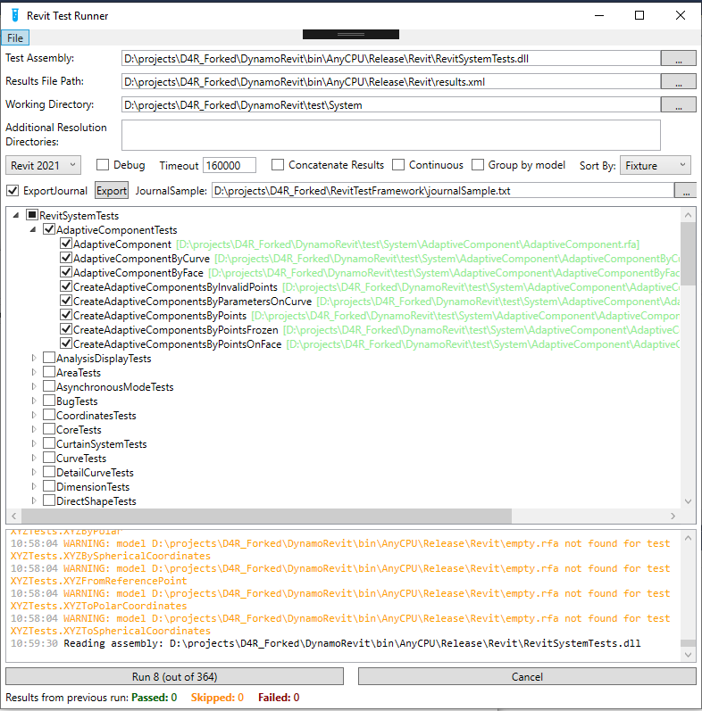

# RevitTestFramework

The Revit Test Framework (RTF) allows you to conduct remote unit testing on Revit. RTF takes care of creating a journal file for running revit which can specify a model to start Revit, and a specific test or fixture of tests to run. You can even specify a model to open before testing and RTF will do that as well. 

[](https://ci.appveyor.com/project/marchello2000/revittestframework/branch/mark/Revit2019) 
[](https://www.nuget.org/packages/revittestframework)

## Applications

There are two ways to run RTF:
* **RevitTestFrameworkConsole.exe**  
   A Console application to run test from a command line
* **RevitTestFrameworkGUI.exe**  
   A GUI application that allows easy selection of tests to run and check results

Both options run the tests in the same way

### RevitTestFrameworkConsole.exe  
A console application which allows running RTF without a user interface. If you'd like to learn more about the command line options for RTF, you can simply type "RevitTestFrameworkConsole -h" and you'll get something like this:
```
Options:   

         --dir=[VALUE]           The full path to the working directory. The working directory is the directory in which RTF will generate the journal and the addin to Run Revit. Revit's run-by-journal capability requires that all addins which need to be loaded are in the same directory as the journal file. So, if you're testing other addins on top of Revit using RTF, you'll need to put those addins in whatever directory you specify as the working directory.  
    -a,  --assembly=[VALUE]      The full path to the assembly containing your tests.  
    -r,  --results=[VALUE]       This is the full path to an .xml file that will contain the results. 
    -f,  --fixture=[VALUE]       The full name (with namespace) of a test fixture to run. If no fixture, no category and no test names are specified, RTF will run all tests in the assembly.(OPTIONAL)  
    -t,  --testName[=VALUE]      The name of a test to run. If no fixture, no category and no test names are specified, RTF will run all tests in the assembly. (OPTIONAL)    
         --category[=VALUE]      The name of a test category to run. If no fixture, no category and no test names are specified, RTF will run all tests in the assembly. (OPTIONAL)   
         --exclude[=VALUE]       The name of a test category to exclude. This has a higher priortiy than other settings. If a specified category is set here, any test cases that belongs to that category will not be run. (OPTIONAL)  
    -c,  --concatenate           Concatenate the results from this run of RTF with an existing results file if one exists at the path specified. The default behavior is to replace the existing results file. (OPTIONAL)  
         --revit[=VALUE]         The Revit executable to be used for testing. If no executable is specified, RTF will use the first version of Revit that is found on the machine using the RevitAddinUtility. (OPTIONAL)  
         --copyAddins            Specify whether to copy the addins from the Revit folder to the current working directory. Copying the addins from the Revit folder will cause the test process to simulate the typical setup on your machine. (OPTIONAL)  
         --dry                   Conduct a dry run. (OPTIONAL)  
    -x,  --clean                 Cleanup journal files after test completion. (OPTIONAL)   
         --continuous            Run all selected tests in one Revit session. (OPTIONAL)  
         --groupByModel          Run tests with same model without reopening the model for faster execution, requires --continuous. (OPTIONAL)
         --isExport              Export the journal file for each wanted test. (OPTIONAL)
         --journalSample=[VALUE] A sample file for export. (OPRIONAL)
         --exportFolder=[VALUE]  A folder to store the export journal files. (OPTIONAL)
         --time                  The time, in milliseconds, after which RTF will close the testing process automatically. (OPTIONAL)  
    -d,  --debug                 Should RTF attempt to attach to a debugger?. (OPTIONAL)  
    -h,  --help                  Show this message and exit. (OPTIONAL)  
```

As an example, the following command:
```
RevitTestFrameworkConsole.exe --dir C:\MyTestDir -a MyTest.dll -r MyTestResults.xml -revit:"C:\Program Files\Autodesk\Revit 2019\Revit.exe" --copyAddins --continuous
```
will execute all tests in `MyTest.dll` located in `C:\MyTestDir` and place all results in `MyTestResults.xml` (in the same folder). It will use Revit 2019 as specified and will run all tests without shutting down Revit.

As another example:
```
RevitTestFrameworkConsole.exe --dir C:\MyTestDir -a MyTest.dll -r MyTestResults.xml -revit:"D：\Revit\Revit.exe" --continuous
```
You specified a non-normally installed Revit.exe, you do not need to add the '--copyAddins' parameter. You need to manually copy a `Dynamo.addin` file to your working directory 'C:\MyTestDir'. The `dynamo.addin` file looks like this:
```
<?xml version="1.0" encoding="utf-8" standalone="no"?>
<RevitAddIns>
<AddIn Type="Application">
<Name>Dynamo For Revit</Name>
<Assembly>"'Your DynamoRevit folder'\Revit\DynamoRevitVersionSelector.dll"</Assembly>
<AddInId>8D83C886-B739-4ACD-A9DB-1BC78F315B2B</AddInId>
<FullClassName>Dynamo.Applications.VersionLoader</FullClassName>
<VendorId>ADSK</VendorId>
<VendorDescription>Dynamo</VendorDescription>
</AddIn>
</RevitAddIns>
```

The results of the run as well as any `Console.WriteLine` or `Console.Error.WriteLine` from test will be shown in the command window and written ot the results xml file, e.g.:

```
Reading assembly: D:\MyTestDir\MyTest.dll
Loaded test: Name: UnitTest1, Model Path: D:\MyTestDir\MyModel1.rvt (D:\MyTestDir\MyModel1.rvt)
Loaded test: Name: UnitTest2, Model Path: D:\MyTestDir\MyModel2.rvt (D:\MyTestDir\MyModel2.rvt)
Running D:\Projects\UpCodes\upcodes_revit\Tests\2019\bin\Debug\RTF_Batch_Test.txt
Running UnitTest1 in BasicTests
Success: UnitTest1 in BasicTests

Running UnitTest2 in BasicTests
Success: UnitTest2 in BasicTests

Waiting for Revit to terminate
WARNING: One or more journal files could not be deleted.
```

The warning about some journal files not being deleted can be safely ignored.

You can use console application to generate Journal files for exporting:
```
RevitTestFrameworkConsole.exe -a MyTest.dll -t:[TestName] --isExport --journalSample MyJournalSample.txt --exportFolder C:\MyFolder
```

### RevitTestFrameworkGUI.exe   
Provides a visual interface for you to choose tests from a treeview and to visualize the results of the tests as they are run. The same settings provided in the command line argument help above are available in the UI. The UI also allows you to save your testing session.

The input fields to set the test assembly, the working directory, and the results file, as well as the tree view where available tests are displayed, support dragging and dropping of files and folders.

RevitTestFrameworkGUI.exe can also take an argument for the test assembly path and will automatically fill all values on start so you can just hit `Run`.

 

`File` - For saving and loading your local RTF config.  
`Test Assembly` - Path to assembly containing the tests to run. E.g. RevitNodesTests.dll, RevitSystemTests.dll, RevitServicesTests.dll.  
`Results File Path` - Path to the xml file containing the tests results. If it's an existing file, RTF will replace it.  
`Working Directory` - Path to where the testing Revit files are.  
`Additional Resolution Directories` - Path to find Dynamo Core location when it is not set in the `Dynamo.Config` in DynamoRevit bin folder.  
`Debug` - Check this if you decide to launch a debug session.  
`Timeout` - in milliseconds, the maximum time for a test to run. If a test doesn't finish in this time, Revit will be forcefully terminated and new test session without the offending test will start (the offending test will be marked as `timedout`).  
`Continuous` - same as above, run tests without restarting Revit for each test.  
`GroupByModel` - same as above, run tests with the same model without reopening the model.  
`ExportJournal` - Enable the export journal files use a JournalSample to create expected journal files.  
`JournalSample` - Path to a txt which will use to create journal files.  

JournalSample like this:
```
'Dim Jrn 
Set Jrn = CrsJournalScript 
Dim fs: Set fs = CreateObject("Scripting.FileSystemObject") 
Jrn.Command "StartupPage" , "Open this project , ID_FILE_MRU_FIRST" 
Jrn.Data "MRUFileName"  , "{0}" 
Jrn.RibbonEvent "Execute external command:{1}:{2}" 
Jrn.Data "APIStringStringMapJournalData", 6, "testName", "{3}", "fixtureName", "{4}Tests", "testAssembly", "{5}", "resultsPath", "{6}", "debug","{7}","workingDirectory","{8}" 
Jrn.Command "Internal" , "Flush undo and redo stacks , ID_FLUSH_UNDO" 
Jrn.Command "SystemMenu" , "Quit the application; prompts to save projects , ID_APP_EXIT"
```

## Results  

The output file from a test run is an nunit-formatted results file compatible with many CI systems.  
For documentation how to use RTF inside a CI system, see [this guide](docs/using_with_ci.md)

## Revit Versions

This repo maintains branches to track the two most recently released versions of Revit and one un-released version of Revit. When new versions of Revit are released, branches tracking the oldest version of Revit supported will no longer be maintained. For example, when Revit 2016 is released, the Revit 2014 branch of RTF will no longer be maintained.  
When testing, you should run the version of RTF corresponding to the version of Revit you are running. This will ensure that tests you have created, based on one Revit API, will correspond to the version of the API running on Revit.  
However, the current version of RTF works and can be used to test within Revit 2017, 2018, and 2019.

## Build Configurations

If you want to build RTF on a machine that don't have a Revit installed, you can put the Revit API related dlls under folder lib\Revit $(RevitVersionNumber)\net452 which was defined in CS.props. The build can be success, but if you want to run RTF, you still need a machine with Revit installed.

## License

Copyright 2014 Autodesk

Licensed under The MIT License; you may not use this file except in compliance with the License. You may obtain a copy of the License at

http://opensource.org/licenses/MIT

THE SOFTWARE IS PROVIDED "AS IS", WITHOUT WARRANTY OF ANY KIND, EXPRESS OR
IMPLIED, INCLUDING BUT NOT LIMITED TO THE WARRANTIES OF MERCHANTABILITY,
FITNESS FOR A PARTICULAR PURPOSE AND NONINFRINGEMENT. IN NO EVENT SHALL THE
AUTHORS OR COPYRIGHT HOLDERS BE LIABLE FOR ANY CLAIM, DAMAGES OR OTHER
LIABILITY, WHETHER IN AN ACTION OF CONTRACT, TORT OR OTHERWISE, ARISING FROM,
OUT OF OR IN CONNECTION WITH THE SOFTWARE OR THE USE OR OTHER DEALINGS IN
THE SOFTWARE.
